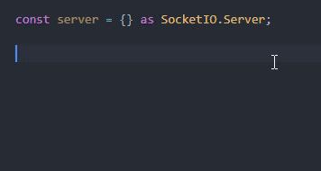

# rxjs-from-emitter

A statically typed, more powerful alternative to RxJS's `fromEvent`.

```shell
$ npm i rxjs-from-emitter
```

Tested with TS 3.5 with strict mode, probably won't work for previous versions. For previous versions you can still try writing `"click" as "click"` instead of just `"click"`, it might work.

Also `document.querySelector` returns `Element`, make sure to make it `HTMLElement` either via assertion (cast) or via type parameter

## Features

In the following examples, by "error" I mean compile-time static errors not runtime. Also examples work for all kinds of event emitters not just DOM's `EventTarget` or node's `EventEmitter`.

### Observable inferences corresponding to callback arguments

```typescript
fromEmitter(document.body).event("click") // Observable<MouseEvent>
fromEmitter(spawn("echo", ["hello"])).event("exit") // Observale[number | null, string | null]>

const myEmitter = new class {
    on(
        name: "event-1",
        listener: (arg1: "something", arg2: number) => void
    ): void
    on(
        name: "event-2",
        listener: (arg1: "onlyOneArgumentSoNoArray") => void
    ): void
    on(name: string, listener: (...args: any[]) => any  ) {}

    off(name: string, listener: Function) {}
}

fromEmitter(myEmitter).event("event-1"); // Observable<["something", number]>
fromEmitter(myEmitter).event("event-2"); // Observable<"onlyOneArgumentSoNoArray">

```

### Error on invalid event identifiers

```typescript
fromEmitter(document.body).event("foo");
// allowed because you can do document.body.dispatch(new Event("foo"))

fromEmitter(document.body).eventStrict("foo"); // error
// not allowed in strict version which takes only literals defined in the type.

```

### Extras arguments taken into consideration

```typescript
const myEmitter = new class {
    on(
        name: "event-1",
        listener: (arg1: "something", arg2: number) => void,
        emitInterval: number
    ) {}

    off(name: "event-1", listener: (arg1: "something", arg2: number) => void) {}
}

fromEmitter(myEmitter).event("event-1"); // error: Expected 2 arguments, but got 1.
fromEmitter(myEmitter).event("event-1", 1000); // no error, Observable<["something", number]>
```

### Support for custom method names without any compromise on types

```typescript
const myEmitter = new class {
    anotherMethod() { }
    aProperty = "hello";

    register(name: "event-1", listener: (arg1: "something", arg2: number) => void) {}
    unregister(name: "event-1", listener: (arg1: "something", arg2: number) => void) {}
}

fromEmitter(myEmitter).event("event-1") // error couldn't identify methods

fromEmitter(myEmitter)
.withMethods("register", "unregister")
.event("event-1");
// ok, Observable<["something", number]>

fromEmitter(myEmitter)
.withMethods("register", "anotherMethod")
.event("event-1");
// error `anotherMethod` doesn't satisfy the required type

fromEmitter(myEmitter)
.withMethods("register", "register")
.event("event-1");
// error, can't pass the same methods.

const io = require("socket.io")();

fromEmitter(io).event("connect")
// error because couldn't find "off" method

fromEmitter(io)
.withMethods("on", null)
.event("connect");
// ok, Observable<Socket>

```

### Doesn't assume the event identifiers type

```typescript
const myEmitter = new class {
    on(
        event: 0,
        listener: (arg1: "something", arg2: number) => void
    ): void
    on(
        event: { type: "foo" },
        listener: (arg1: "onlyOneArgumentSoNoArray") => void
    ): void
    on(name: string, listener: (...args: any[]) => any  ) {}

    off(name: any, listener: Function) {}
}

fromEmitter(myEmitter).event(0) // no error, Observable<["something", number]>
fromEmitter(myEmitter).event({ type: "foo" }) // no error, Observable<"onlyOneArgumentSoNoArray">
```

### Type-level code, but no hacks

There is a lot of TypeScript type-level code involved. As a matter of fact type-level code is almost 6 times more than the runtime code.
But there is no hackish stuff like recursive types that drain CPU & RAM and are [also not recommend to be used by the TypeScript folks](https://github.com/microsoft/TypeScript/pull/24897#issuecomment-401418254). They can also break in future [as they broke in past](https://github.com/microsoft/TypeScript/issues/30188#issue-416399563). `rxjs-from-emitter` has non of those.

### Auto-completion, better DX

You get auto-completion for event identifiers, and also since the Observable is correctly inferred you get auto-completions because of that too.



### Don't like the API? You can still have some features using `fromEvent` and `fromEventStrict` exported from `rxjs-from-emitter/compat`. It's not fully compatible with RxJS's `fromEvent` though

```typescript
import { fromEvent } from "rxjs-from-emitter/compat"

fromEvent(process, "exit" as "exit"); // Observable<number>
```

### [It also solves some \*cough* flaws \*cough* of `fromEvent`](https://github.com/devanshj/rxjs-from-emitter/blob/master/docs/solving-some-from-event-flaws.md)

## What do you lose?

`fromEvent` can take array of event emitters, but `fromEmitter` takes only one. This is to keep static cheking easier and avoid complexity
